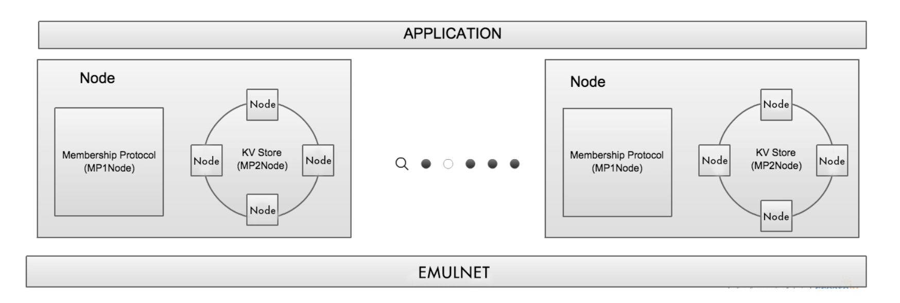

# Key Vaue Store
This repository contains a full implementation of a key value store for [Cloud Computing Concepts:Part 2](https://www.coursera.org/learn/cloud-computing-2) computer assignment. This implemnation includes a three layer archituctre as shown bellow. 



## What is It?

This key-value store which highly inspired by the Casandra key-value store has these main functionalities:

* A key-value store supporting CRUD operations 
  * Create, Read, Update, Delete
* Load-balancing 
  * via a consistent hashing ring to hash both servers and keys
* Fault-tolerance up to two failures 
  * by replicating each key three times to three successive nodes in the ring, starting from the first node at or to the clockwise of the hashed key
* Quorum consistency level for both reads and writes 
  * at least two replicas should have the same read/write value
* Stabilization after failure 
  * recreate three replicas after failure

This implementation includes membership protocol in which I implemented in [my Gossip Membership](https://github.com/gsoosk/Gossip-Membership-Protocol) repository before. 


## Skeleton
Some of the important classes in this repository are:
* `HashTable`: A class that wraps C++11 std::map. It supports keys and values which are std::string.
* `Message`: This class can be used for message passing among nodes. This has already been implemented and provided to you.
* `Entry`: This class can be used to store the value in the key-value store. 
* `Node`: This class wraps each node’s Address and the hash code obtained by consistently hashing the Address. The upcall to MP1Node returns the membership list as a `std::vector<Node>`.
* `MP2Node`: This class must implement all the functionalities of a key-value store, which include the following:
    * Ring implementation including initial setup and updates based on the membership list obtained from MP1Node
    * Provide interfaces to the key value store
    * Stabilizing the key-value store whenever there is a change in membership o Client-side CRUD APIs
    * Server-side CRUD APIs


## How to Run?

**How to run only the CRUD tests**
``` bash
$ make clean
$ make
$ ./Application ./testcases/create.conf
or 
$ ./Application ./testcases/delete.conf
or
$ ./Application ./testcases/read.conf
or
$ ./Application ./testcases/update.conf
```


**How to run all testcases and evalute them**
```bash
$ ./KVStoreGrader.sh
```
